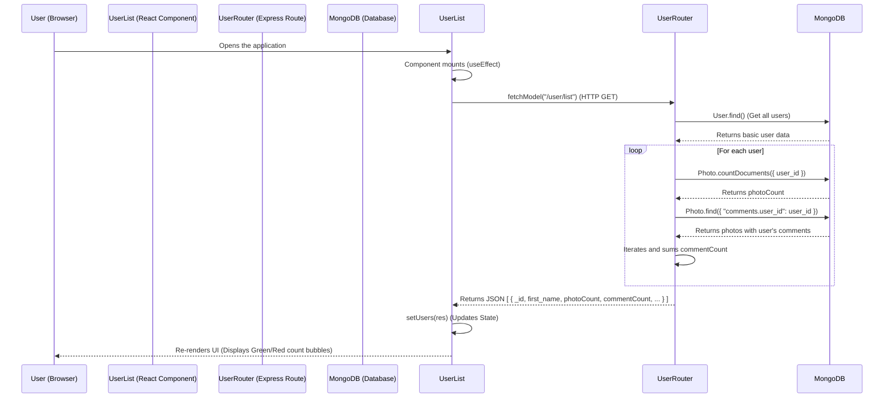
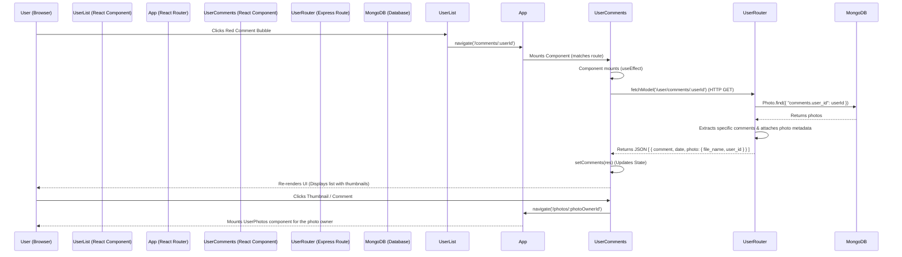
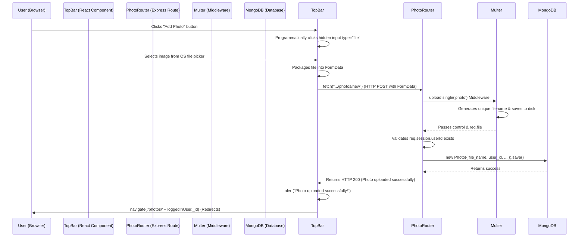
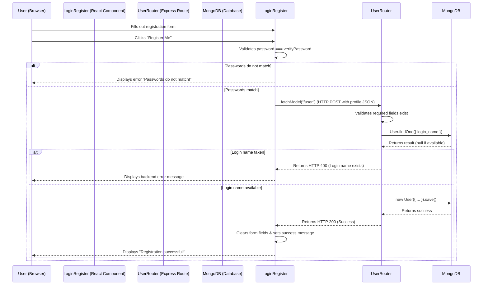

# New Features Code Workflow

This document outlines the execution flow and data lifecycle of the newly implemented features for the Photo Sharing App: the count bubbles in the User List and the new User Comments view.

---

## 1. User List with Count Bubbles Workflow

This workflow describes how the application fetches and displays the photo and comment counts for each user in the sidebar.

### Step-by-Step Breakdown:
1. **Frontend Initiation**: When the application loads, the `<UserList />` component mounts. Its `useEffect` hook triggers an API call to the backend using `fetchModel("/user/list")`.
2. **Backend Processing (`UserRouter.js`)**: 
   - The `/list` route receives the request and fetches the base user documents.
   - Using `Promise.all` and `map`, it iterates over each user.
   - It queries the `Photos` collection to get the total number of photos owned by the user (`photoCount`).
   - It queries the `Photos` collection to get all photos that contain comments made by the user, then programmatically counts the exact number of comments the user authored (`commentCount`).
3. **Frontend Rendering**: The backend returns the augmented user list. The React state is updated (`setUsers`), causing the component to re-render. The UI displays the data using Material UI `<Chip>` components colored green (photos) and red (comments).

---

## 2. User Comments View & Navigation Workflow

This workflow describes the process of viewing a specific user's comments and navigating back to the photo's detail page.

### Step-by-Step Breakdown:
1. **Triggering Navigation**: The user clicks the red comment bubble next to a user's name. The `handleCommentClick` function inside `<UserList />` executes `navigate('/comments/' + userId)`.
2. **Routing**: `App.js` matches the path `/comments/:userId` and renders the new `<UserComments />` component.
3. **Fetching Comments (`UserComments.jsx`)**:
   - The component extracts `userId` from the URL via `useParams()`.
   - The `useEffect` hook triggers a request to the backend: `fetchModel('/user/comments/' + userId)`.
4. **Backend Processing (`UserRouter.js`)**:
   - The `/comments/:id` route handles the request.
   - It searches the `Photos` collection for any photo where this user has left a comment.
   - It filters the comments to only include the ones authored by the requested user.
   - It packages each comment into a new object containing the comment text, date, and critical photo metadata (`file_name` for the thumbnail, and the original photo owner's `user_id`).
5. **Frontend Rendering**: The backend returns the structured list of comments. `<UserComments />` updates its state and renders a Material UI `<List>`. Each `<ListItem>` contains the comment text and an `<Avatar>` displaying the photo thumbnail via `require('../../images/...)`.
6. **Further Navigation**: If the user clicks on a comment or its thumbnail, the `handleItemClick` function fires, calling `navigate('/photos/' + item.photo.user_id)`. The router redirects to the photo detail page for that specific photo's owner.

---

## 3. Photo Uploading Workflow

This workflow describes the process of a logged-in user uploading a new photo.

### Step-by-Step Breakdown:
1. **Triggering Upload**: The user clicks the "Add Photo" button in the `<TopBar />`. This button triggers a `useRef` to artificially click a hidden `<input type="file">`, launching the native file picker.
2. **Packaging Data**: Once a file is selected, the `handleFileChange` function wraps the file in a `FormData` object. A standard `fetch` POST request is sent to the backend, crucially including `credentials: "include"` so the session cookie is transmitted.
3. **Backend Middleware (`Multer`)**: Before the route logic executes, `multer` intercepts the request. It extracts the binary file data, generates a unique filename (using a timestamp and random number), and writes the file directly to the disk (`Front-end/src/images/`).
4. **Database Record**: The `/new` route handler verifies the user's session (`req.session.userId`). It constructs a new `Photo` document containing the newly generated `req.file.filename` and the `user_id`, and saves it to MongoDB.
5. **Frontend Redirect**: Upon receiving a 200 OK status from the server, the frontend alerts the user of the success and automatically redirects them to their own photo gallery (`/photos/:userId`) to view the new upload.

---

## 4. User Registration Workflow

This workflow describes the process of a new user registering an account with all profile fields and password verification.

### Step-by-Step Breakdown:
1. **Frontend Validation**: The user fills out the registration form in the `<LoginRegister />` component. When they click "Register Me", the frontend immediately checks if the `password` state perfectly matches the `verifyPassword` state. If they don't, the submission is halted.
2. **Submitting Data**: If the local validation passes, all profile states are bundled into a JSON payload and POSTed to `/user`.
3. **Backend Validation (`UserRouter.js`)**: The backend first checks that critical fields (`login_name`, `password`, `first_name`, `last_name`) are not null or empty strings.
4. **Uniqueness Check**: The backend queries MongoDB (`User.findOne`) to see if the requested `login_name` already exists. If it does, it responds with a 400 Bad Request to prevent duplicates.
5. **Database Record Creation**: If the username is free, a new `User` document is created using the provided JSON body and saved permanently to MongoDB.
6. **Frontend Feedback**: Upon receiving the 200 OK success response, the React component wipes all state variables (clearing the text boxes on screen) and renders a green success message, prompting the user to use the newly created credentials to log in.
